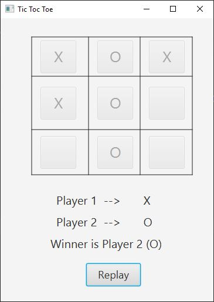

# Tic-Tac-Toe-JavaFX
Simple JavaFX Tic Tac Toe Game. 
 
`image`  
  

## Things and Tools I Used in this project:
<li> IntellIJ IDE </li>
<li> SceneBuilder 8.5  </li>
<li> Java 8 </li>
<li> JavaFX </li> 

## Contributing
Pull requests are welcome. For major changes, please open an issue first to discuss what you would like to change.
Please make sure to update tests as appropriate.

## License
Distributed under the MIT License. See [License](LICENSE) for more information.
